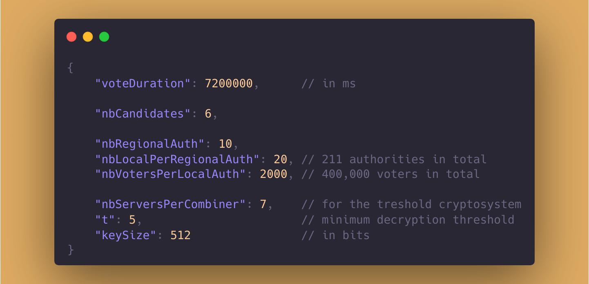

# Secured Election System

[]()
[]()
[]()

**Cryptographically secured** multi-candidate election system using a **treshold version of Paillier Cryptosystem** and **Zero-Knowledge proofs**.

This is an implementation of the paper published in *PODC '01: « Proceedings of the twentieth annual ACM symposium on Principles of distributed computing », August 2001, pages 274–283, available on the [ACM Digital Library](https://doi.org/10.1145/383962.384044)*.

## Usage

### Prerequisites

This project uses `cmake` for the build and the `boost` library for its `multiprecision` and `random` modules.
On a Debian-based system you can install them with:

```
$ sudo apt-get install cmake libboost-all-dev
```

### Initial configuration
Complete the configuration file before running the simulation.

<p align="center">
  
</p>


### Build using CMake

```sh
$ cmake CMakeLists.txt
$ make
```

### Run

- Classic execution of the election system simulation :
```sh
$ ./EVote
```

- Verbose mode on some fraudulent votes (we do not recommand using the `--verbose` on a heavy configuration) :
```sh
$ ./EVote --verbose --votes
```

## Benchmarking

After a few runs of the simulation with different configurations on the same processor, we reached the limit of our implementation at **400,000 voters** for 128 bits keys. 
Below are time metrics taken on the different phases of the execution.
  
|        **Simulation phase**        | **Measured time** |
|:----------------------------------:|:-----------------:|
|       Generation of 200 keys       |       9'03s       |
|     Encryption of 225,000 votes    |       7'25s       |
| Zero-Knowledge Proof verifications |       1'52s       |
|         Treshold decryption        |        < 1s       |


## Authors

* [@Blutch10](https://github.com/Blutch10)
* [@Guerric-H](https://github.com/Guerric-H)
* [@vdElyn](https://github.com/vdElyn)
* [@MaxBuilder](https://github.com/MaxBuilder)


## Remaining

- [ ] Add a keys serialization 
- [ ] Legal vote proof (Zero-knowledge proof 2, § 10.3.2)
- [ ] Partial decryption proof (§ 10.2.1)
- [ ] Vérification des preuves : t+1 bons déchiffrement nécessaires à la combinaison
- [ ] Receipt-free property (§ 10.5)
- [ ] The commitments can be replaced by their hash values (§ 6)
